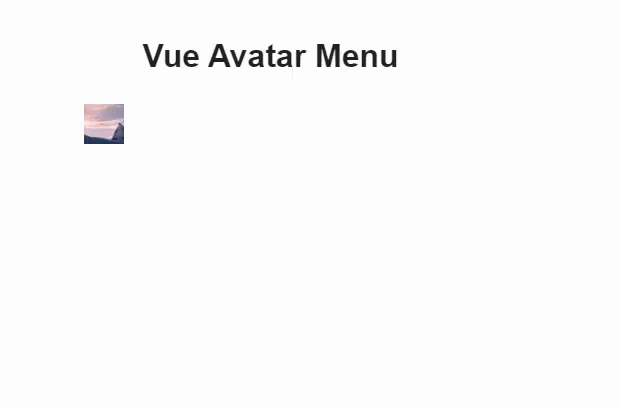

# Vue-Avatar-Menu
É um componente que combina o v-avatar e o v-menu utilizando Vuetify 3.x,  proporcionando uma visualização mais clara da imagem do avatar

## Install 
#### NPM 
Para usar o componente em seu projeto Vue 3, instale o pacote via NPM:

```bash 
npm install v-avatar-menu
``` 
## Uso
No seu projeto Vue, importe e registre o componente:

```javascript 
import { createApp } from 'vue';
import App from './App.vue';
import {createVuetify} from 'vuetify'  // if you are already using Vuetify 
import VAvatarMenu from 'v-avatar-menu';

const app = createApp(App);

app.use(vuetify);
app.component('v-avatar-menu', VAvatarMenu);
app.mount('#app');
```
## Exemplo de Uso
Você pode usar o componente da seguinte maneira:

```vue
<template>
         <v-avatar-menu :item="item" size="40"></v-avatar-menu>
</template>

<script>
import { defineComponent } from 'vue';

export default defineComponent({
    data: () => ({
         item: {
            urls_imagem:[
               {
                  "anexo": "52c94d54-a9c0-4599-8f0e-2d391bb4c010",
                  "nome": "52c94d54-a9c0-4599-8f0e-2d391bb4c010_original.jpg",
                  "capa": true,
                  "urls": [
                     {
                        "tamanho": "50",
                        "url": "https://picsum.photos/seed/picsum/400/300"
                     },
                     {
                        "tamanho": "original",
                        "url": "https://picsum.photos/seed/picsum/400/300"
                     }
                  ]
               }
			],
            imagens:[{src:'https://picsum.photos/seed/picsum/400/300'}],
      }
	}),
});
</script>

```

#### Tamanhos diferentes 
Voce pode passar a mesma imagem com tamanhos diferentes 

```json 
  item: {
            urls_imagem:[
               {
                  "anexo": "52c94d54-a9c0-4599-8f0e-2d391bb4c010",
                  "nome": "52c94d54-a9c0-4599-8f0e-2d391bb4c010_original.jpg",
                  "capa": true,
                  "urls": [
                     {
                        "tamanho": "50",
                        "url": "https://picsum.photos/seed/picsum/400/300"
                     },
                     {
                        "tamanho": "original",
                        "url": "https://picsum.photos/seed/picsum/400/300"
                     }
                  ]
               }
			],
      }
```
Ou passar a mesma imagem diretamente 
```json 
  item: {
         imagens:[{src:'https://picsum.photos/seed/picsum/400/300'}],
      }
```


#### Props
* item: (Object) Item a ser exibido no menu. .
* size: (Number) Tamanho do avatar em pixels.
* rounded: Define o quão redondo será o avatar

#### Events
* @callback: Evento que é disparado ao clicar no botão de confirmação (OK). No exemplo, a função executar() é chamada quando o usuário confirma a ação.

#### Slots
Este componente atualmente não utiliza slots.

#### Referências
* https://primevue.org/confirmpopup/ (based on primevue)
